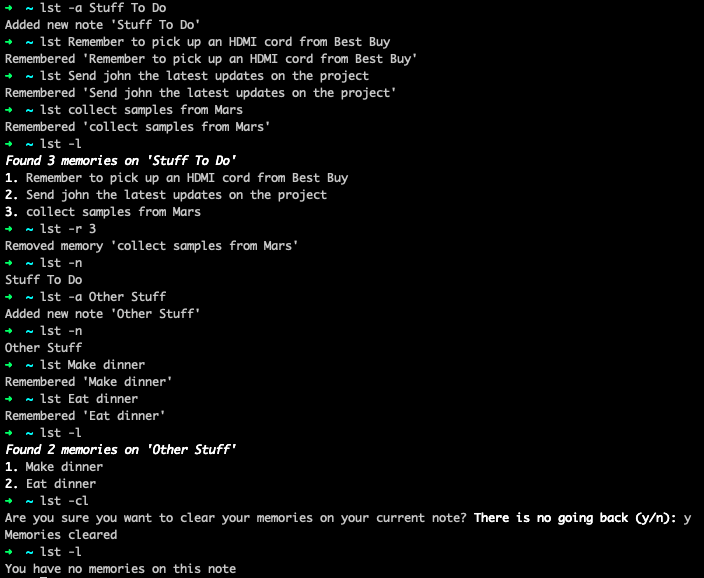

.. homebrew-liszt documentation master file, created by
   sphinx-quickstart on Fri Aug  7 13:22:35 2020.
   You can adapt this file completely to your liking, but it should at least
   contain the root `toctree` directive.

Welcome to Liszt's documentation!
==============================================

**Liszt** is a command-line tool designed to
make taking small notes from the command line as
easy as possible.

Liszt in Action
--------------------
*In your terminal*

Installation
------------

Install **Liszt** by first running ``brew tap scamacho23/liszt``.
Next, run ``brew install lst``. Start using ``lst`` by running ``lst -h``
or ``lst -help`` to view the available commands.

Contribute
----------

- Make issues at https://github.com/scamacho23/homebrew-liszt/issues
- Source code held at https://github.com/scamacho23/homebrew-liszt

Support
-------

If you are having issues with your version of **Liszt**,
submit an issue at our github page (link above). Make sure to update
**Liszt** relatively frequently by running ``brew update``
and then ``brew reinstall lst``.
*To view your version of Liszt, run 'lst -version' or 'lst -v'*

.. toctree::
   :maxdepth: 2
   :caption: Contents:

Indices and tables
==================

* :ref:`genindex`
* :ref:`modindex`
* :ref:`search`
